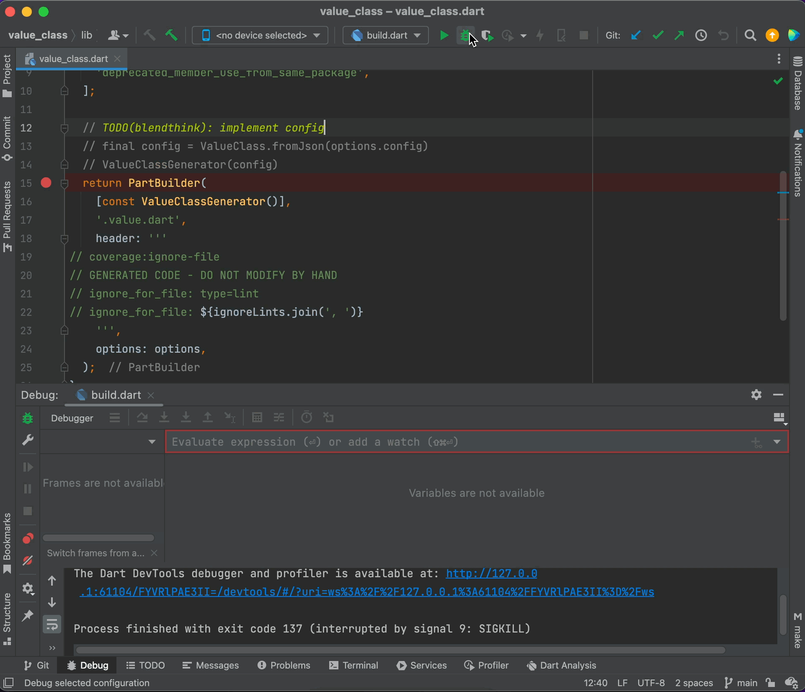

# Welcome to contributing guide

Thank you for investing your time in contributing to our project!

Read our [Code of Conduct] to keep our community approachable and respectable.

## Packages

### [value_annotation]

A package of annotation classes for [value_class].\
No test code is needed and this package will not be modified except when adding functionality.

### [value_class]

Uses [build_runner] to automatically generate the necessary code for a "Value Class" from a class annotated with `@valueClass`.\
Needs to enrich with tests.

## Setup

### Open project

Open [value_class] package using [IntelliJ IDEA].

### Install Dart SDK

Basically, we develop with the latest stable version. [Get the Dart SDK]

After installation, check the version.

```shell
dart --version
```

### Install dependencies 

```shell
dart pub get
```

### Operation check 

```shell
dart run build_runner build
```

### Debug

Use [Run/debug configurations] in [IntelliJ IDEA].\
Please make use of the shared configuration file [build.dart.run.xml].

> **Warning**\
> [Run/debug configurations] will not be available unless\
> you run `dart run build_runner build` once.

[Breakpoints] allow you to pause program execution at a specific point and examine the state and behavior of the program, which can be very useful.



## Contributing

For simple fixes such as typos and additions to test code, no problem to submit a pull request without creating an issue.

### Open a new Issue

Search if an issue already exists.\
If a related issue doesn't exist, you can open a new issue using a relevant [issue form].


### Commit your update

Once your changes are ready, don't forget to [self-review] speed up the review process.

### Submit a Pull Request

When you're finished with the changes, create a pull request, also known as a PR.

### Your PR is merged!

Congratulations 🎉🎉 Thanks you ✨

<!-- Links -->
[Code of Conduct]: ./CODE_OF_CONDUCT.md
[value_annotation]: ./packages/value_annotation
[value_class]: ./packages/value_class
[build_runner]: https://pub.dev/packages/build_runner
[IntelliJ IDEA]: https://www.jetbrains.com/idea
[Get the Dart SDK]: https://dart.dev/get-dart
[Run/debug configurations]: https://www.jetbrains.com/help/idea/run-debug-configuration.html
[build.dart.run.xml]: ./packages/value_class/.run/build.dart.run.xml
[Breakpoints]: https://pleiades.io/help/idea/using-breakpoints.html
[issue form]: https://github.com/blendthink/value_class.dart/issues/new/choose
[self-review]: ./docs/contributing/self-review.md
